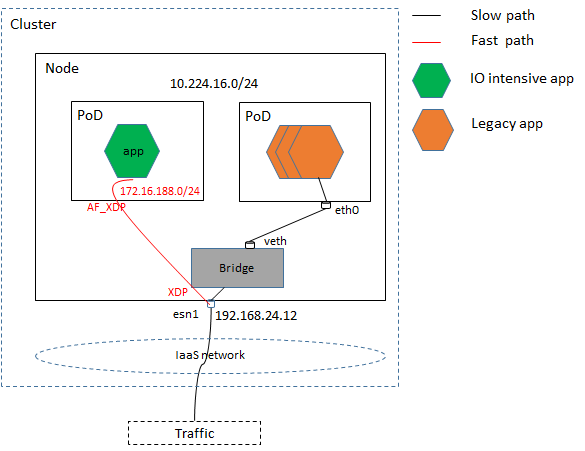
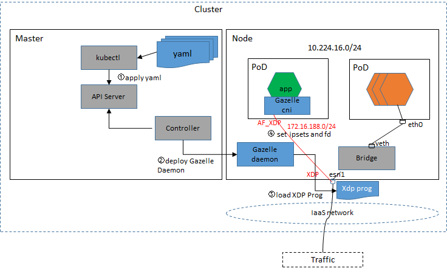
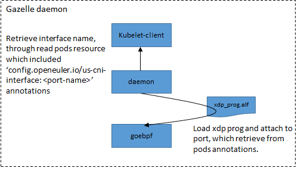
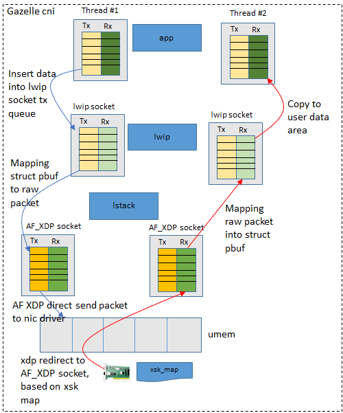

# Scenario

## usecase1: IO intensive APP independent deployment without DPDK HW





- **Prerequisite**

1. The app need certified by Gazelle CNI,  and then already included nginx, gmdb.
2. Traffic can visit esn1 through layer 3 network.
3. Traffic have route used to visit esn1 subnet (similar as figuer 172.16.188.0/24).


- **Requirement**

1. Accelerate  both ingress and egress direction of  path witch from esn1 to app,  and powered by AF_XDP.
2. Filtering inbound packets with XDP.


**spec**

```
# Gazelle daemonset yaml
apiVersion: apps/v1
kind: DaemonSet
metadata:
  name: gazelle-daemon
  namespace: kube-system
  labels:
    app: gazelle-daemon
spec:
  selector:
    matchLabels:  # Used to match pod, which need deploy gazelle cni
      cni: gazelle
  updateStrategy:
    type: RollingUpdate
  template:
    metadata:
      labels:
        app: gazelle-daemon
    spec:
      hostNetwork: true
      containers:
      - name: gazelle-daemon
        image: xxxxxx  # gazelle daemon image address
        resources:
          limits:
            memory: 200Mi
          requests:
            cpu: 100m
            memory: 200Mi
        securityContext:
          privileged: true
          capabilities:
            add: ["SYS_ADMIN"]
         volumeMounts:
        - name: varlog
          mountPath: /var/log
        - name: varlibdockercontainers
          mountPath: /var/lib/docker/containers
          readOnly: true
       volumes:
       - name: varlog
         hostPath:
           path: /var/log
       - name: varlibdockercontainers
         hostPath:
           path: /var/lib/docker/containers
```


Deployment IO intensive APP  example:

```
kind: ConfigMap
apiVersion: v1
metadata:
  name: gazelle-cni-config
  namespace: kube-system
data:
  ipset1: "172.16.188.0/24"
    
---
apiVersion: apps
kind: Pod
metadata:
  name: nginx
  labels:
    app: nginx
    cni: gazelle  # Used to deploy Gazelle daemon, by daemonset 'matchLabels' 
  annotations:
    config.openeuler.io/us-cni-interface: esn1 # Used to select interface
spec:
  hostNetwork: true  # Must set host model
  nodeSelector:
    openeuler.io/role: io-intensive-app # Used to select node
  containers:
  - name: nginx
  image: nginx:1.14.2
    ports:
    - containerPort: 80
  env:           # Create evn value from configmap object
    - name: IPSET
      valueFrom:
        configMapKeyRef:
          name: gazelle-cni-config
          key: ipset1
    - name: PORTNAME
      valueFrom:
        fieldRef:
          fieldPath: metadata.annotations
```




- YAML: included Gazelle CRD,  Pod deployment， Gazelle daemon deployment. 
- Gazelle daemon：Provides XDP prog management.
- XDP Porg：Filtering inbound packets.
- Gazelle CNI：Manage AF_XDP socket and provides TCP/IP stack.


## Design


### Data-plane

Key Data Structure:

```
struct {
    IP ips
    Port port
} ipsets;

struct {
	__uint(type, BPF_MAP_TYPE_ARRAY);
	__uint(max_entries, 128);
	__type(key, struct ipsets);
	__type(value, __u32);
} xsk_maps SEC(".maps");
```

Pseudocode:

```
1. Retrieving packets destination IPs/Port, though parse header
2. Find xsk_map entry, through destination IPs/Port
if finded:
   bpf_redirect_map(&xsk_map, entry_index, 0)
else:
   return XDP_PASS
```


### Gazelle daemon

Gazelle daemon retrieve interface, and load/attach xdp prog onto it.




### Gazelle cni

- Function:

1. Alloc umem in initialization stage.
2. Retrieve port-name and ipset, through read environment variable(IPSET, PORTNAME).
3. Create AF_XDP socket and rx/tx queues, when app invoke socket() or epoll_wait().
4. Update xsk_map data, with AF_XDP socket fd and IPSET.
5. Mapping raw packets to struct pbuf, when rx queue has packet.
6. Mapping struct pbuf to raw packet and insert into tx queue, when app write/send socket.





## usecase2: IO intensive APP independent deployment with DPDK HW


## usecase3: IO intensive APP independent deployment with SR-IOV HW


## usecase4: Legacy/IO intensive APP hybrid deployment without DPDK HW


## usecase5: Legacy/IO intensive APP hybrid deployment with DPDK HW


## usecase6: Legacy/IO intensive APP hybrid deployment with SR-IOV HW


