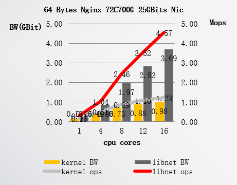
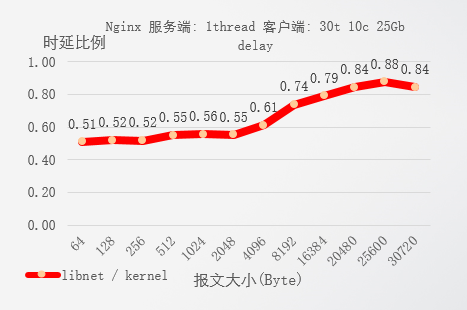
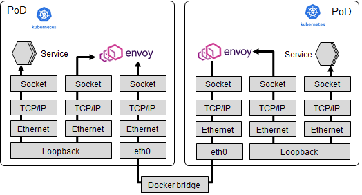
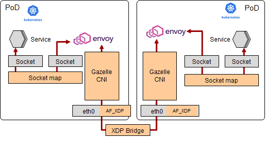

# Gazelle-cni

#### 动机

Gazelle是一款华为内部已商用的用户态协议栈，支持TCP/UDP协议栈，其性能、适用性相比较同类软件而言存在诸多优势，包括并发线性度、低时延、易用性等方面。

性能参考加速Nginx的效果图如下：

​																					线性度接近1

​																					时延全面占优

易用性方面特点：无需应用修改代码，无需要应用重新编译，加速库安装即可用。

Gazelle-CNI项目的是希望开源华为内部Gazelle商业项目，并将其应用到云原生场景，作为加速云原生ServiceMesh的重要技术之一。

云原生场景中ServiceMesh已经成为各云场景中的标配组件，而其中istio实现的事实标准。Envoy是istio其中的数据面组件，所以本项目的目标是加速Envoy组件。

#### 目标

性能：提升服务网格数据面性能，达到集群内服务访问时延降低30%，集群内服务访问吞吐量提升30%。

易用性：开源istio无需修改代码，无需重新构建，实现即插即用。

#### 总体介绍

Envoy作为istio的数据面组件，接管网格内的所有对外的数据流，并完成相关的LB、统计等功能。数据流视图参考下图：

其中我们可以看到整个数据流路径冗长，对服务网格的性能存在瓶颈。所以我们对其整个数据路径进行加速，加速方案如下：

其中的加速加速包括：

1. Gazelle CNI：基于华为内部商业项目Gazelle进行改造。
2. socket-map：使用eBPF的sockmap技术实现socket之间加速。
3. XDP Bridge：使用XDP技术实现Bridge功能，并将其作为kubelet缺省拉起的Bridge。

#### 路标规划（暂定）

0. Gazelle项目开源：2021.6.30之前完成源码开源。
1. Gazelle-CNI 技术demo演示：2021.3.30之前完成demo演示，Envoy能够同时应用Gazelle协议栈以及内核协议栈，完成单节点加速。
2. Gazelle-CNI 技术开发：2021.5.30之前完成Gazelle项目的CNI适配，以及AF_XDP适配。
3. socket-map技术：2021.6.30之前完成技术开发。
4. XDP bridge技术：2021.7.30之前完成技术开发。

#### 加入我们

目前Gazelle技术已经成熟，但是Gazelle-CNI等其他技术目前正在设计、原型验证阶段，欢迎社区内感兴趣的同学能够加入我们的项目设计、开发中。

#### 联系我们

 [high-performance-network@openeuler.org](mailto:high-performance-network@openeuler.org)  	 [dev@openeuler.org](mailto:dev@openeuler.org) 